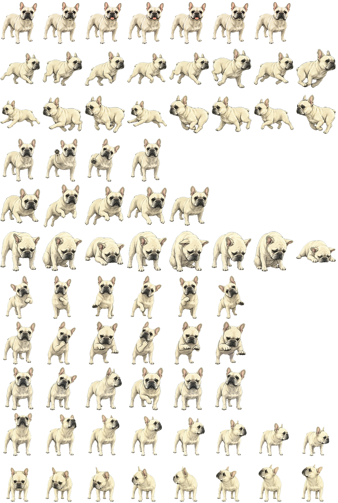

# Marco — Codex Pet

Marco is a classic cream French bulldog companion for the Codex desktop app and compatible Codex CLI terminals.



## Install on macOS or Linux

Review [`install.sh`](install.sh), then run:

```sh
curl -fsSL https://raw.githubusercontent.com/zzzhouzhenzz/codex-pet-marco/main/install.sh | sh
```

The installer:

- downloads `pet.json` and `spritesheet.webp` from this repository;
- checks both files against [`SHA256SUMS`](SHA256SUMS);
- backs up an existing Marco installation as `marco.backup-YYYYMMDD-HHMMSS`;
- installs Marco at `${CODEX_HOME:-$HOME/.codex}/pets/marco`.

The checksum detects transfer errors. It is not an independent signature because the files and checksum are hosted in the same repository.

## Activate Marco

1. Open **Codex Settings > Pets**.
2. Select **Refresh**, then choose **Marco**.
3. Enter `/pet`, or choose **Wake Pet** from the command menu.

If Codex still shows a cached version, fully quit and reopen the app, then switch away from Marco and back again.

## Manual installation

```sh
git clone https://github.com/zzzhouzhenzz/codex-pet-marco.git
mkdir -p "${CODEX_HOME:-$HOME/.codex}/pets/marco"
cp codex-pet-marco/pet/pet.json "${CODEX_HOME:-$HOME/.codex}/pets/marco/pet.json"
cp codex-pet-marco/pet/spritesheet.webp "${CODEX_HOME:-$HOME/.codex}/pets/marco/spritesheet.webp"
```

## Validate the package

The validator uses only the Python standard library:

```sh
python3 scripts/validate_pet.py
python3 -m unittest discover -s tests -v
```

It checks the Marco manifest, WebP container, `1536 x 1872` dimensions, and alpha support.

## `codex-pets` registry status

This GitHub repository is the canonical package source. Marco has not been uploaded to the separate `codex-pets.net` service, so `npx codex-pets add marco` is not currently supported.

## Attribution

Marco is a cream-coat recolor of [Frankie](https://codex-pets.net/#/pets/frankie), originally published by **Arty** on `codex-pets.net`. The animation poses, character design, and line art come from Frankie; this repository changes the coat color and package identity.

The upstream listing exposes no license. This repository therefore adds no license or claim of additional rights.
